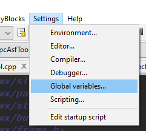
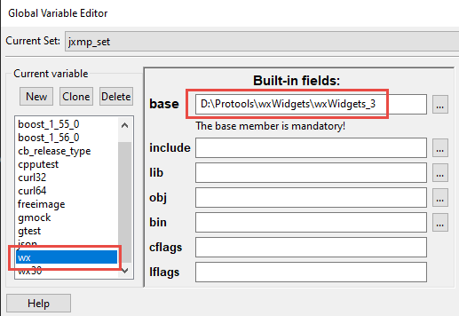
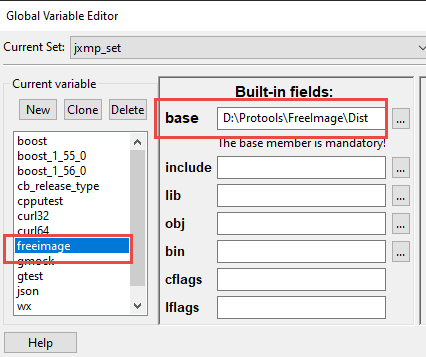
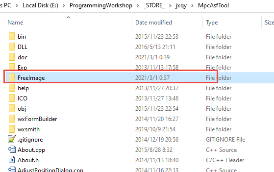

剑侠情缘单机 MPC ASF 文件 编辑 工具

早期的程序，代码写的比较烂，呵呵

---

## 如何编译：

1.下载[wxWidget 3.0.0版本](https://github.com/wxWidgets/wxWidgets/releases/download/v3.0.0/wxWidgets-3.0.0.7z)

2.使用MinGW编译器（使用CodeBlocks内置的MinGW编译器即可），编译wxWidget，编译教程见，wxWidgets路径/docs\msw\install.txt

- codeblock 下载[mingw-32bit-setup.exe]( https://sourceforge.net/projects/codeblocks/files/Binaries/15.12-RC1/codeblocks-15.12mingw-setup-RC1.exe/download)
- gcc要用5.5？？

`mingw32-make -f makefile.gcc BUILD=debug`

`mingw32-make -f makefile.gcc BUILD=release`

//- tips, 可加 -w参数禁用warning mingw32-make -f makefile.gcc BUILD=debug -w
```
gcc 6.3和以上版本，需要打开
wx\src\tiff\libtiff\tif_config.h

将
define snprintf _snprintf

修改为
/* MSVC 14 does have snprintf() and doesn't allow defining it.  Also MinGW32
   starting with GCC 6.3 has changed _snprintf so that it is no longer suitable.
   It does have snprintf, so just use it. */
#if defined (__MINGW32__) && (__GNUC__ > 6 || (__GNUC__ == 6 && __GNUC_MINOR__ > 2))
  /* do nothing*/
#elif !defined(_MSC_VER) || _MSC_VER < 1900
# define snprintf _snprintf
#endif
-参考自https://trac.wxwidgets.org/ticket/17936

src/stc/scintilla/src/Editor.cxx 增加#include <cmath>引用并将
5844 和 5846 行abs改为std::abs
https://github.com/wxWidgets/wxWidgets/commit/73e9e18ea09ffffcaac50237def0d9728a213c02

```
3.在CodeBlocks里

设置wx变量，base是wxWidgets库的路径

设置freeimage变量，base用工程里的FreeImage库










```
- freeimage 的release是vs编译的，需要去下载然后mingw编译https://sourceforge.net/projects/freeimage/files/Source%20Distribution/3.15.4/
- mingw32-make -f makefile.mingw
- mingw32-make install

编译错误修改：
- FreeImage\Source\OpenEXR\IlmImf\ImfAutoArray.h 需要加上 #include <string.h>

- 可能需要加mingw32-make -f makefile.mingw -no-narrowing  //https://stackoverflow.com/questions/51861932/error-narrowing-conversion-of-199-from-int-to-char-inside-wnarrowin

1.) Open a DOS shell (run application cmd.exe)

2.) Ensure, that the 'bin' folders of both MinGW and GnuWin32 are
    added to the PATH environment variable (see Prerequisites).

3.) Create the FreeImage dynamic link library (DLL):

    C:\>make

4.) Install the FreeImage dynamic link library (DLL):

    C:\>make install

5.) Clean all files produced by the recent build process:

    C:\>make clean

6.) Create a static FreeImage library:

    C:\>set FREEIMAGE_LIBRARY_TYPE=STATIC
    C:\>make
```

4.如果要Build Release-static，需要[upx](https://upx.github.io/)来压缩exe文件，把upx.exe放在PATH系统变量的任何路径里的文件夹就可以